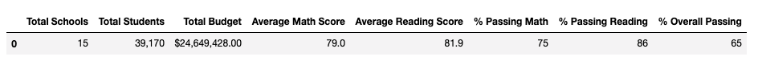

# School_District_Analysis
## Python Project with City Schools

### Overview of the school district analysis: 
This project was to  provide an analysis of standardize testing scores of reading and math for all of the inner city high schools. This analysis was for the purpose of identifying trends within the district by viewing the number of students, the amount of spending per student, the school's overall budgets, and other variables as they relate to student performances by grade within each institution. This analysis will give both a school specific view and a district view of trends affecting testing performances. 

Within this analysis you will be provided a snapshot of the district's key metrics, an overview of each school's key metrics, and this information will consist of the folowing:

  - The top and bottom 5 performing high schools. This will be based on the overall passing rate of the tests
  - Average score of math by grade level and school
  - Average score of reading by grade level and school
  - How performace relates to school budget per student
  - How performance relates to school size
  - How performance relates to type of school (District or Charter)

### District's Key Metrics:

- The top and bottom 5 performing high schools based on the overall passing rate of the tests

- Average score of math by grade level and school

- Average score of reading by grade level and school

- How performance relates to school budget per student
 

- How performance relates to school size

- How performance relates to type of school (District or Charter)

### Analysis Results:
In this section, we will be discussing the results of our analysis and the changes that have occurred as a result of replacing Thomas High School's 9th grade test results with Nans. This was done after evidence of academic dishonesty was discovered. We will identify and analyze the changes that have occurred as a result of these NaNs through answering the following questions:

- How is the district summary affected?

District Summary before NaNs:
 

 
District Summary after NaNs:

As we can see from the photos, there really is not much of a difference between the District Summaries of before NaNs and after NaNs were incorporated with the changes of the testing scores of Thomas High School's 9th grade class. At the most, the change is as big as a tenth of a number. 

- How is the school summary affected?

School Summary before NaNs:

School Summary after NaNs:

 
  
School Summary with NaNs/9th grade reading and math scores (NaNs) fully excluded:

Based on the data above, the only changes between the school summary before NaNs were added, after NaNs, and when the 9th grade scores (comprised of NaNs) were fully excluded from the school summary data, are significantly shown in the % Passing Math, % Passing Reading, and % Overall Passing scores. The greatest difference is between the School Summary before and after NaNs were incorporated. When the 9th grade testing scores were excluded altogether, the School Summary excluding that data closely resembled the percentages of the School Summary prior to the NaN incorporation. 

- How does replacing the ninth graders’ math and reading scores affect Thomas High School’s performance relative to the other schools?

By replacing the ninth graders' math and science scores, it caused Thomas High School to fall in rank against the other schools. Thomas High School was initially a top five school within the district. It was number two to be exact. If the school had not excluded the NaNs from their overall school/district summary, the high school would have fallen in rank significantly. Thomas High School went from a % Overall Passing score of 90.95% to 65.08%.

- How does replacing the ninth-grade scores affect the following:

  - Math and reading scores by grade:

  

  

The only items affected was that the math and reading scores for the 9th graders was replaced with NaNs instead of actual grades. Every other grade in the school and the district were not affected.

  - Scores by school spending

  

There was absolutely no change between the school scores by spending before the NaNs were incorporated and after the NaNs were incorporated to replace the 9th grade math and reading scores, neither for Thomas High School, nor for the district overall.

  - Scores by school size

  
  
There was absolutely no change between the schools' scores by size before the NaNs were incorporated and after the NaNs were incorporated to replace the 9th grade math and reading scores, neither for Thomas High School, nor for the district overall.

  - Scores by school type
  
  
  
There was absolutely no change between the schools' scores by school type before the NaNs were incorporated and after the NaNs were incorporated to replace the 9th grade math and reading scores, neither for Thomas High School, nor for the district overall.

### Summary:
In conclusion to this analysis, some changes did occur after the reading and math scores for the ninth graders at Thomas High School were replaced with NaNs. These four changes occurred as a result of the updated district analysis and are as follows:

  1. There was a change in the % Passing Math
  2. There was a change in the % Passing Reading
  3. There was a change in the % Overall Passing
  4. Once the ninth grade test scores were fully excluded from Thomas High Schools testing data, all of the % scores mentioned above returned to nearly the exact      same scores as they were before
  
In conclusion to the results and this overall analysis, we discovered that by inserting NaNs to replace the ninth grade test scores of reading and math, the % Passing Math, % Passing Reading, and the % Overall Passing scores did fall and would have dropped Thomas High Schools' ranking in the district significantly had the ninth grade test scores not been exluded from the school's summary. Once the school excluded their ninth grade testing scores from the overall school summary, the school's math, reading, and overall test scores return back to their original percentages. 
